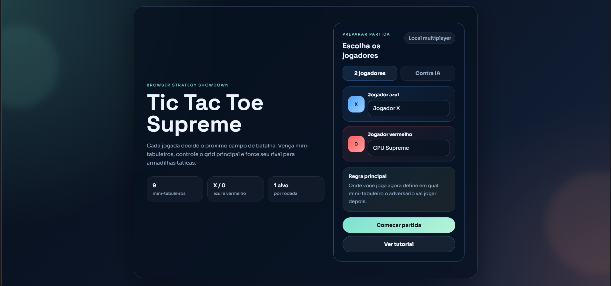
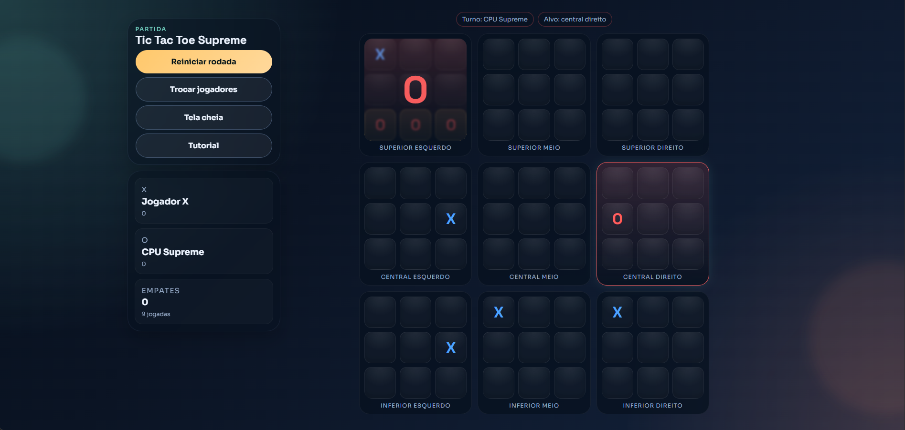

# Tic Tac Toe Supreme

Ultimate Tic-Tac-Toe para navegador feito com React + TypeScript.

Cada casa do tabuleiro principal abre um novo jogo da velha 3x3. A jogada atual define em qual mini-tabuleiro o adversario precisa jogar depois, criando uma camada extra de estrategia, controle de ritmo e armadilhas taticas.

## Preview





## Principais recursos

- modo local para 2 jogadores
- modo solo contra IA
- IA com dificuldades `facil`, `media` e `dificil`
- tutorial guiado dentro do app
- placar acumulado entre rodadas
- persistencia com `localStorage`
- efeitos sonoros, animacoes leves e layout responsivo
- suporte a tela cheia

## Regras basicas

1. O tabuleiro principal possui 9 mini-tabuleiros.
2. O jogador `X` comeca.
3. Ao marcar uma casa dentro de um mini-tabuleiro, voce envia o adversario para o mini-tabuleiro correspondente no tabuleiro principal.
4. Se o mini-tabuleiro de destino estiver vencido ou cheio, o proximo jogador pode jogar em qualquer mini-tabuleiro aberto.
5. Vencer um mini-tabuleiro faz essa casa contar no tabuleiro principal.
6. Quem conquistar 3 mini-tabuleiros em linha no tabuleiro principal vence a partida.

## Como rodar localmente

### Requisitos

- Node.js 18+ recomendado
- npm instalado

### Instalar dependencias

```bash
npm install
```

### Iniciar em desenvolvimento

```bash
npm start
```

Abra no navegador:

```text
http://localhost:3000
```

### Gerar build de producao

```bash
npm run build
```

## Como testar rapidamente

1. Abra `http://localhost:3000`
2. Escolha `2 jogadores` ou `Contra IA`
3. Se usar IA, selecione simbolo e dificuldade
4. Clique em `Comecar partida`
5. Jogue algumas rodadas, recarregue a pagina e confirme se o estado foi restaurado

## Scripts

- `npm start` - inicia o app em desenvolvimento
- `npm run build` - gera a build de producao
- `npm test` - abre o runner de testes do Create React App

## Estrutura principal

- `src/App.tsx` - fluxo principal da aplicacao e interface
- `src/game.ts` - regras do Ultimate Tic-Tac-Toe
- `src/ai.ts` - tomada de decisao da IA
- `src/audio.ts` - efeitos sonoros com Web Audio API
- `src/index.css` - identidade visual e responsividade

## Observacoes

- `localStorage` funciona tambem em `localhost`
- os efeitos sonoros dependem de interacao do usuario para serem liberados pelo navegador
- o placar e a partida em andamento ficam salvos entre recarregamentos
